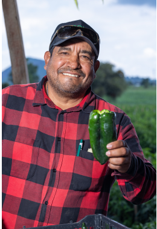
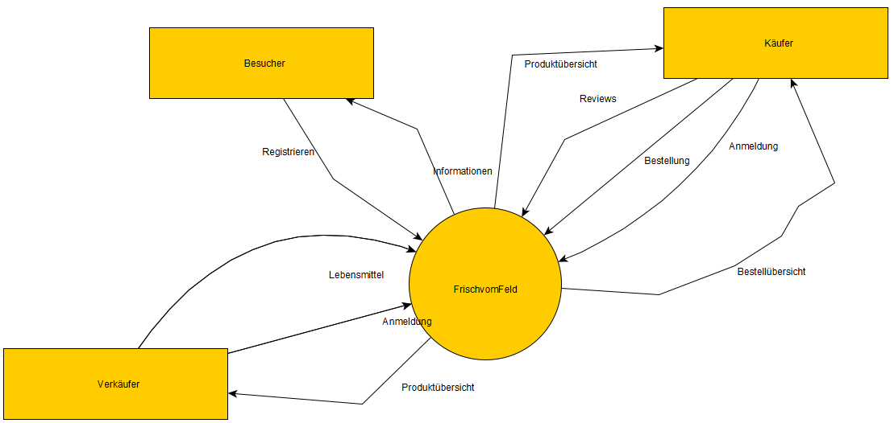
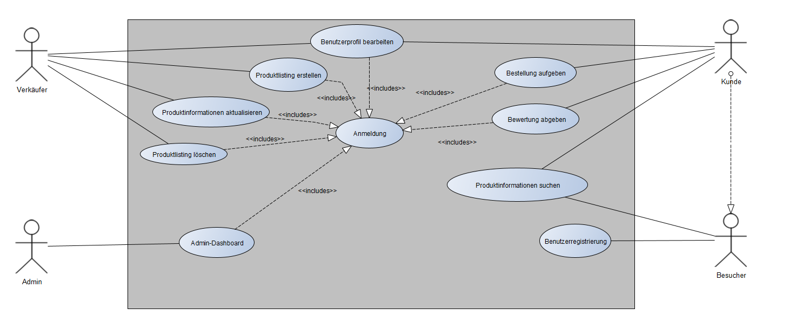
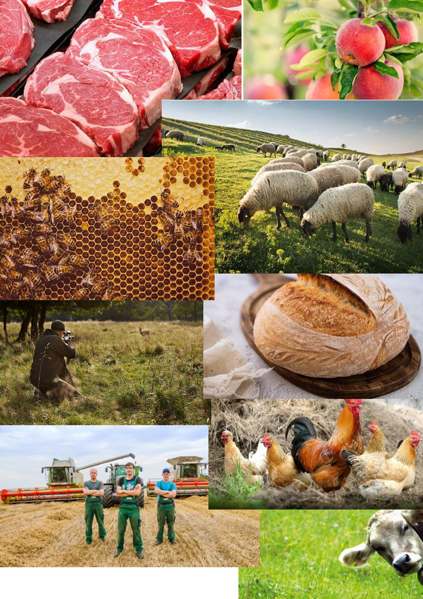
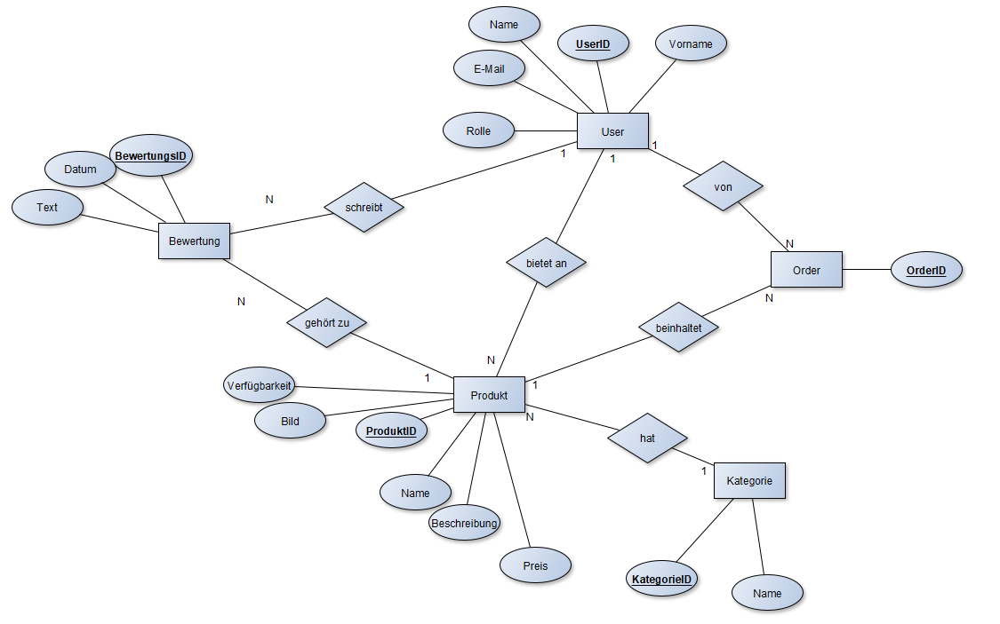
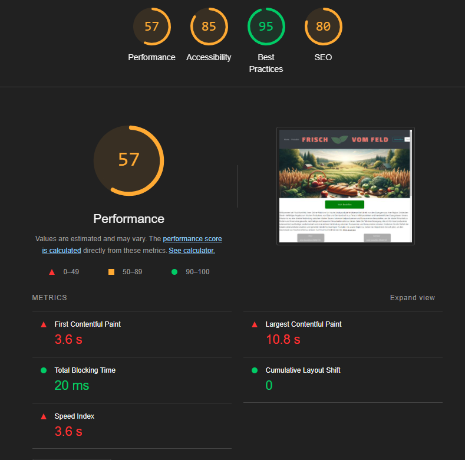
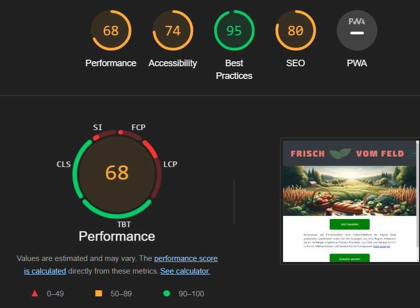

# FrischVomFeld

a [Sails v1](https://sailsjs.com) application

### Links

+ [Sails framework documentation](https://sailsjs.com/get-started)
+ [Version notes / upgrading](https://sailsjs.com/documentation/upgrading)
+ [Deployment tips](https://sailsjs.com/documentation/concepts/deployment)
+ [Community support options](https://sailsjs.com/support)
+ [Professional / enterprise options](https://sailsjs.com/enterprise)

### Version info

This app was originally generated on Thu Nov 09 2023 15:03:45 GMT+0100 (Mitteleuropäische Normalzeit) using Sails v1.5.8.

<!-- Internally, Sails used [`sails-generate@2.0.8`](https://github.com/balderdashy/sails-generate/tree/v2.0.8/lib/core-generators/new). -->

<!--
Note:  Generators are usually run using the globally-installed `sails` CLI (command-line interface).  This CLI version is _environment-specific_ rather than app-specific, thus over time, as a project's dependencies are upgraded or the project is worked on by different developers on different computers using different versions of Node.js, the Sails dependency in its package.json file may differ from the globally-installed Sails CLI release it was originally generated with.  (Be sure to always check out the relevant [upgrading guides](https://sailsjs.com/upgrading) before upgrading the version of Sails used by your app.  If you're stuck, [get help here](https://sailsjs.com/support).)
-->

## Spezifikation und Design

### 1.1. Projektziele

**Lokale Vernetzung fördern:**
Das Hauptziel der Webapplikation "FrischVomFeld" ist die Förderung der lokalen Vernetzung zwischen Lebensmittelproduzenten und Konsumenten. Durch die Bereitstellung einer Online-Plattform sollen lokale Bauern und Lebensmittelproduzenten ermutigt werden, ihre Produkte direkt an die Verbraucher in ihrer Umgebung zu verkaufen.

**Transparenz und Bildung:**
"FrischVomFeld" zielt darauf ab, die Transparenz im Lebensmittelkauf zu erhöhen und die Verbraucher über die Herkunft der Produkte sowie über nachhaltige Landwirtschaftspraktiken zu informieren. Durch klare Produktinformationen und aufklärende Inhalte über nachhaltige Praktiken wird ein bewussterer Konsum gefördert.

**Einfacher Zugang zu frischen Produkten:**
Die Applikation soll den Zugang zu frischen, lokal produzierten Lebensmitteln erleichtern. Durch einfache Such- und Bestellprozesse können Verbraucher schnell und unkompliziert frische Produkte direkt von lokalen Produzenten erwerben.

**Benutzerfreundlichkeit und Responsiveness:**
Die Entwicklung einer benutzerfreundlichen Oberfläche, die auf verschiedenen Geräten reibungslos funktioniert, ist ein wesentliches Ziel. Dies umfasst auch die Gestaltung eines einfachen und effizienten Bestell- und Liefermanagementsystems, das sowohl für Verbraucher als auch für Produzenten leicht zu nutzen ist.

**Feedback und ständige Verbesserung:**
Ein Bewertungs- und Feedbacksystem wird implementiert, um die Zufriedenheit der Nutzer zu messen und wertvolles Feedback für die Produzenten zu sammeln. Dieses Feedback soll zur kontinuierlichen Verbesserung der Plattform genutzt werden.

Mit "FrischVomFeld" wird eine Brücke zwischen lokalen Lebensmittelproduzenten und Verbrauchern geschlagen, die es ermöglicht, frische Produkte auf einfache und bequeme Weise zu erwerben, während gleichzeitig das Bewusstsein für nachhaltige und lokale Konsumpraktiken geschärft wird.

### 1.2. Personas

#### Lokaler Produzent - Hans Bauer

**Alter:** 52 Jahre

**Beruf:** Landwirt und Lebensmittelproduzent

**Charakteristika:** Engagiert und stolz auf seine landwirtschaftliche Arbeit. Technisch nicht sehr versiert, bevorzugt einfache und intuitive Lösungen. Interessiert an nachhaltiger Landwirtschaft und lokaler Wirtschaftsförderung.

**Motivation, die "FrischVomFeld" zu nutzen:** Sucht nach effizienten Wegen, seine Produkte lokal zu vermarkten und neue Kunden zu gewinnen.

#### Bewusste Verbraucherin - Maria Grün

**Alter:** 28 Jahre

**Beruf:** Umweltwissenschaftlerin

**Charakteristika:** Engagiert in Umweltschutz und nachhaltigem Konsum. Technisch versiert und offen für neue Technologien. Gesundheitsbewusst und interessiert an lokaler, organischer Ernährung.

**Motivation, die Plattform "FrischVomFeld" zu nutzen:** Sucht eine zuverlässige Quelle für frische, lokal produzierte Lebensmittel.

#### Beschäftigter Elternteil - Tim Schmidt

**Alter:** 35 Jahre

**Beruf:** IT-Projektmanager

**Charakteristika:** Beschäftigt mit beruflichen Verpflichtungen und der Betreuung seiner kleinen Kinder. Gesundheits- und qualitätsbewusst, legt Wert auf frische und nachhaltige Lebensmittel für seine Familie.

**Motivation, die Plattform "FrischVomFeld" zu nutzen:** Sucht eine schnelle und einfache Möglichkeit, frische und gesunde Lebensmittel zu bestellen.

### 1.3. Kontextdiagramm

### 1.4 Aktoren und Use Cases

#### Akteure:

- **Besucher:** Potenzielle Käufer, die nach frischen, lokal produzierten Lebensmitteln suchen.
- **Käufer:** Endverbraucher, die von einem vereinfachten Zugang zu frischen Lebensmitteln profitieren.
- **Verkäufer:** Lokale Bauern und Lebensmittelproduzenten, die ihre Produkte über die Plattform anbieten.
- **Admin:** Verantwortlich für die Verwaltung und den reibungslosen Betrieb der Plattform.

#### Use-Cases:

- **Produktlisting erstellen**
  - **Beschreibung:** Der Verkäufer hat die Möglichkeit, auf der Plattform ein neues Produktlisting zu erstellen,
   um seine Waren anzubieten. Dabei gibt er alle erforderlichen Informationen wie Produktname, Beschreibung, Preis
    und Verfügbarkeit an. Zusätzlich lädt er Bilder des Produkts hoch, um den Kunden eine visuelle Vorstellung des
     angebotenen Artikels zu vermitteln.
  - **Akteur:** Verkäufer
  - **Auslösendes Ereignis:** Klick auf "neues Produkt".
  - **Skripte:** pages/addProduct.ejs & api/controllers/ProductController.js

- **Produktinformationen aktualisieren**
  - **Beschreibung:** Der Verkäufer hat die Möglichkeit, bei Änderungen an den Details eines Produkts die entsprechenden
   Produktinformationen auf der Plattform zu aktualisieren. Dies beinhaltet Anpassungen an der Produktbeschreibung, dem 
   Preis, der Verfügbarkeit oder den Produktbildern. Dadurch wird sichergestellt, dass die Kunden stets mit aktuellen
   und korrekten Informationen versorgt werden.
  - **Akteur:** Verkäufer
  - **Auslösendes Ereignis:** Klick auf "ändern" in Produktübersicht.
  - **Skripte:** pages/product/edit.ejs & api/controllers/ProductController.js

- **Produktlisting löschen**
  - **Beschreibung:** Der Verkäufer hat die Befugnis, ein Produktlisting zu entfernen, wenn das Produkt nicht mehr verfügbar
   ist oder aus anderen Gründen nicht mehr auf der Plattform gelistet werden soll. Diese Maßnahme trägt dazu bei, die 
   Plattform aktuell und übersichtlich zu halten. Zudem verhindert sie mögliche Verwirrung oder Frustration bei den Kunden.
  - **Akteur:** Verkäufer
  - **Auslösendes Ereignis:** Klick auf "löschen" in Produktübersicht.
  - **Skripte:** pages/product/edit.ejs & api/controllers/ProductController.js

- **Bestellung aufgeben**
  - **Beschreibung:** Der Kunde hat die Möglichkeit, durch die verschiedenen Produktlistings zu stöbern, Produkte in den 
  Warenkorb zu legen und letztendlich die Bestellung abzuschließen. Dabei werden ihm die ausgewählten Produkte sowie 
  der Gesamtpreis angezeigt, um ihm eine informierte Kaufentscheidung zu ermöglichen.
  - **Akteur:** Kunde
  - **Auslösendes Ereignis:** Klick auf "Bestellen" im Warenkorb.
  - **Skripte:** pages/order/shoppingbasket.ejs & api/controllers/ShoppingBasketController.js

- **Bewertung abgeben**
  - **Beschreibung:** Nach dem Erhalt und Testen der Produkte hat der Kunde die Möglichkeit, auf der Plattform eine Bewertung
   abzugeben. Dabei kann er Kommentare schreiben, um seine Erfahrungen mit dem Produkt und dem Verkäufer zu teilen. Dies trägt
   dazu bei, anderen Kunden bei ihrer Kaufentscheidung zu helfen.
  - **Akteur:** Kunde
  - **Auslösendes Ereignis:** Ausfüllen des textareas und Klick auf "bewerten" Button klicken.
  - **Skripte:** pages/product/show.ejs & api/controllers/ReviewController.js

- **Admin-Dashboard**
  - **Beschreibung:** Der Administrator verfügt über ein Dashboard, über das er die Plattform verwalten kann. Dabei hat er die 
  Möglichkeit, Benutzer und Kategorien zu überprüfen, Feedback von Kunden zu lesen und gegebenenfalls Verkäufer sowie Käufer zu 
  entfernen, um die Qualität und Sicherheit der Plattform zu gewährleisten.
  - **Akteur:** Admin
  - **Auslösendes Ereignis:** Click auf "Admin" Button im header.
  - **Skripte:** pages/admin/index.ejs & api/controllers/UsermanagementController & api/controllers/CategoryController.js

- **Benutzerregistrierung**
  - **Beschreibung:** Ein Nutzer kann sich auf der Plattform anmelden, um entweder als Kunde oder Verkäufer aktiv zu werden. 
  Hierzu gibt der Nutzer die erforderlichen Informationen, wie seinen Namen, seine E-Mail-Adresse und ein Passwort an. 
  Zusätzlich wählt er die entsprechende Rolle (Kunde oder Verkäufer) aus, und somit wird ein neues Benutzerkonto erstellt.
  - **Akteur:** Besucher
  - **Auslösendes Ereignis:** Klick auf "Registrieren".
  - **Skripte:** pages/login/signup.ejs & pages/login/login.ejs & api/controllers/UserController.js

- **Produktinformationen suchen**
  - **Beschreibung:** Der Kunde hat die Möglichkeit, auf der Plattform gezielt nach bestimmten Produkten zu suchen oder durch 
  verschiedene Kategorien zu stöbern, um Produkte zu entdecken, die seinen Interessen entsprechen. Dank einer Suchfunktion und 
  Kategorienfilter kann er die angezeigten Produkte präzise eingrenzen. Auf den Produktseiten findet der Kunde detaillierte 
  Informationen zu den jeweiligen Produkten, darunter Bilder, Preise und Kundenbewertungen.
  - **Akteur:** Kunde, Besucher
  - **Auslösendes Ereignis:** Such- und Filtervorgang von Produkten.
  - **Skripte:** pages/product/index.ejs & api/controllers/ProductController.js

## Design

### 2.1. Moodboard

### 2.2. Style Tile

+ [Style Tile](https://www.figma.com/file/Q2ML6EVT5KXCV5eYpCgqwu/Aufgabe-2?type=design&node-id=0%3A1&mode=design&t=hCkmGMtfKtQJWjQ1-1)

### 2.3. Wireframe

+ [Wireframe](https://www.figma.com/file/Q2ML6EVT5KXCV5eYpCgqwu/Aufgabe-2?type=design&node-id=0%3A1&mode=design&t=hCkmGMtfKtQJWjQ1-1)

### 2.4. ER-Diagramm

## Implementierung

### Produktlisting erstellen

## Optimierung

### 4.1. SEO
Die SEO Suchbegriffe die wir ausgesucht haben, waren hauptsächlich Wörter die wir auf unserer Hompage in Texten stehen haben oder sehr ähnlich zu den Texten auf der Hompage sind.
Daher gab es bezüglich den Suchbegriffen nichts zum optimieren:

- regionales bio fleisch
- fleisch online kaufen
- nachhaltigke lebensmittel
- qualitativ hochwertiges obst gemüse fleisch fisch
- lokale lebensmittelproduktion
- lieferservice

### Performance
Nach dem ersten Performance Test mit Lighthouse hatten wir folgendes Ergebnis:

Nach dem der erste Performance Test nicht so gut ausfiehl, haben wir unser Banner auf der Startseite kompriniert und den Code so angepasst, dass ab einer bestimmten Bildschirmgröße immer ein neues, an das Format angepasste Bild genommen wird und nicht das Bild auf jede größe zugeschnitten wird.

Dieses Ergebnis ist nun nicht deutlich besser, aber besser als das alte.

